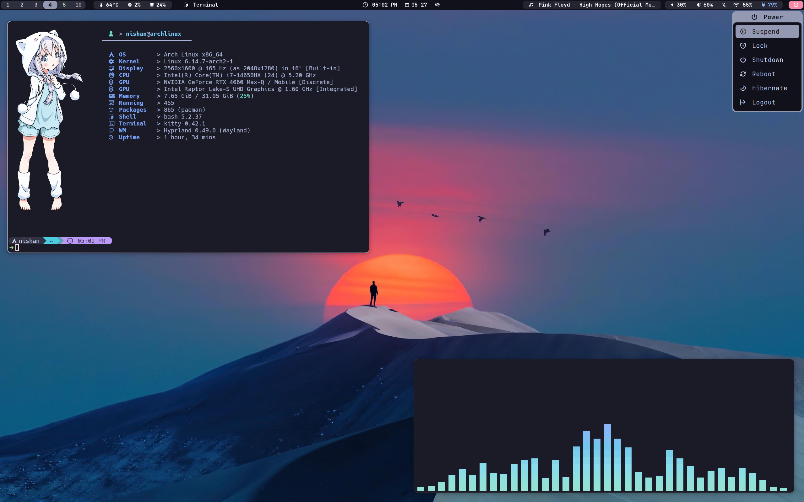
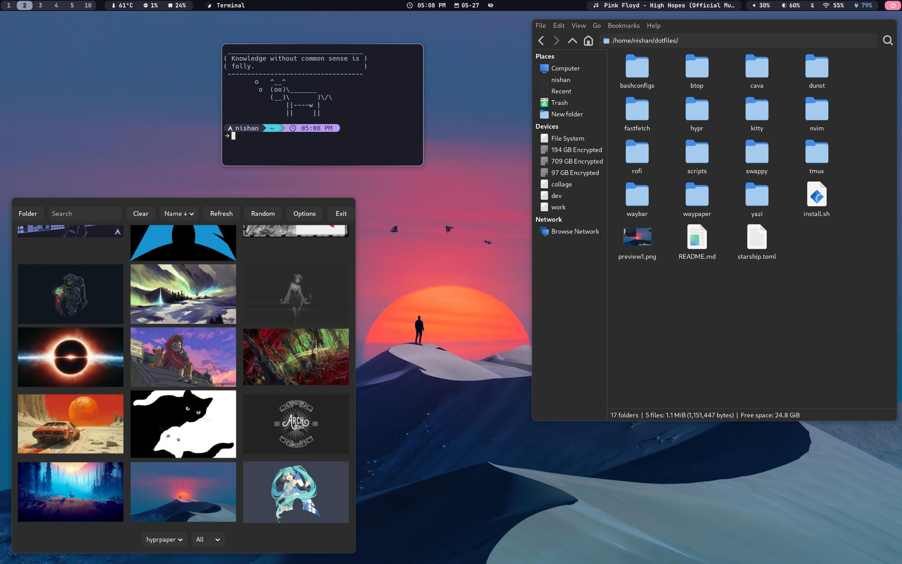
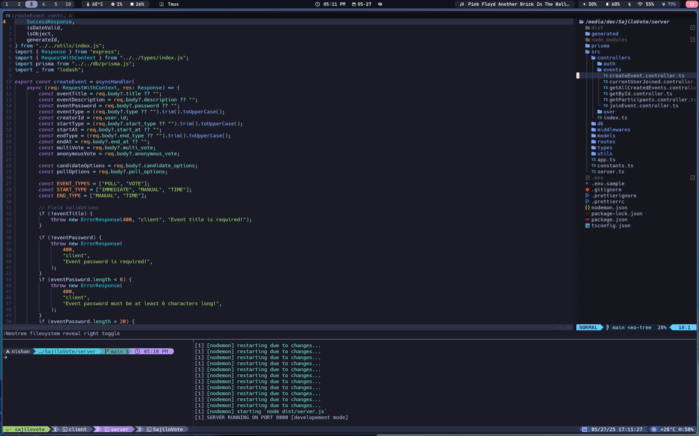

# 🧠 My Personal Dotfiles – Arch Linux + Hyprland

Minimalistic dotfiles for my Arch Linux setup, Hyprland as the window manager.
This configuration is designed to be lightweight, fast, and easy to use, with a focus on minimalism.
---

# Preview




## ⚡ Quick Installation

To install my dotfiles and get started instantly, run:

```bash
source <(curl -s https://www.nishanbista.com/dotfiles.sh)
```

### What happens running this command?
- Clones my dotfiles into your home directory.
- Creates symbolic links to place configs in their proper locations.
- (Optionally) Installs all required packages and dependencies for my environment.

# Packages
##  pacman packages
- `btop` – Modern resource monitor
- `cava` – Terminal audio visualizer
- `dunst` – Lightweight notification daemon
- `fastfetch` – System info fetcher
- `kitty` – GPU-accelerated terminal
- `neovim` – Modern Vim-based text editor
- `rofi-wayland` – Launcher/dmenu replacement
- `tmux` – Terminal multiplexer
- `waybar` – Status bar for Wayland
- `starship` – Cross-shell prompt
- `waypaper` – Wallpaper manager
- `blueman-manager` – Bluetooth manager
- `pavucontrol` – volume control
- `yazi` – Tui file manager

#### 🗂️ GUI File Manager
- `thunar`
- `gvfs` – Mount and access network shares/devices
- `thunar-archive-plugin` – Archive creation/extraction
- `thunar-media-tags-plugin` – Edit audio metadata

##### 🔎 Thumbnail Support
- `tumbler`
- `ffmpegthumbnailer`

#### Hyprland Ecosystem 
- `hyprland`
- `hypridle` - Idle handler
- `hyprlock` - Lock screen
- `hyprpaper` - Wallpaper daemon

#### Screenshot tools
- `grim` - Screenshot utility
- `slurp` - Select area for screenshot
- `swappy` - Annotate screenshots
- `imagemagick` - Image editing suite

## AUR packages


# Keybindings
## Rofi
- `SUPER + Space` - Toogle rofi dmenu

## Screenshot
- `SUPER + ALT + 0` - Take a screenshot of selected area 
- `SUPER + ALT + SHIFT + 0` - Take a screenshot of the entire screen

## Wallpaper 
- `SUPER + W` - Open wallpaper selector (_waypaper_). **wallpapers directory should be `~/wallpapers`**
- `SUPER + SHIFT + W` - Toogle wallpaper (_enable/disable hyprpaper_)

## Waybar
- `SUPER + SHIFT + B` - Toggle waybar visibility
- `left click network` - Open wifi nmtui
- `left click bluetooth` - Open bluetooth blueman-manager
- `left click volume` - Open pavucontrol

## Power menu
- `super + O ` Open power menu

## Others
- `SUPER + P` - Play/Pause media
- `SUPER + E` - Open terminal
- `SUPER + C` - Kill active window
- `SUPER + Q` - Open file manager (_In float mode_)
- `SUPER + T` - Float window
- `SUPER + SHIFT + T` - Float all windows
- `SUPER + F` - Toggle fullscreen 
- `SUPER + SHIFT + F` - Maximize window
- `SUPER + SHIFT + J` - Toggle split orientation
- `SUPER + SHIFT + K` - Swap split 
- `SUPER + vim (HJKL)` - Switch focus 
- `SUPER + arrow keys` - Switch focus  
- `SUPER + SHIFT + arrow keys` - Resize window

- `SUPER + SHIFT + M` - Exit hyprland

# Feel free to customize and use <3!
