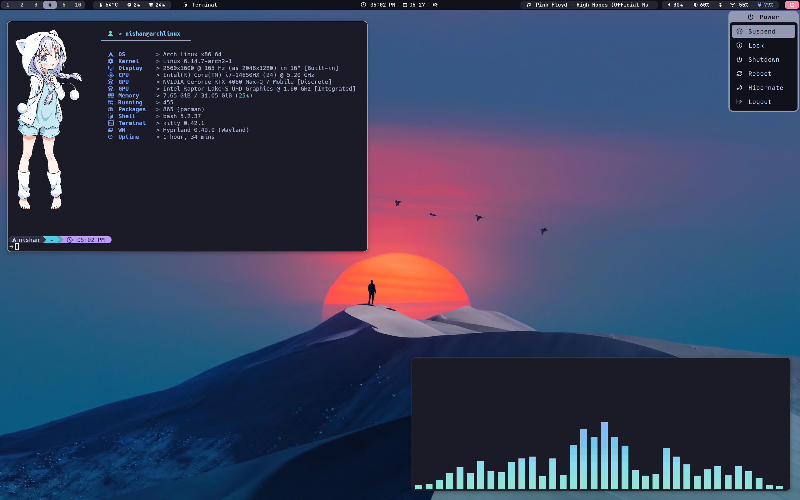
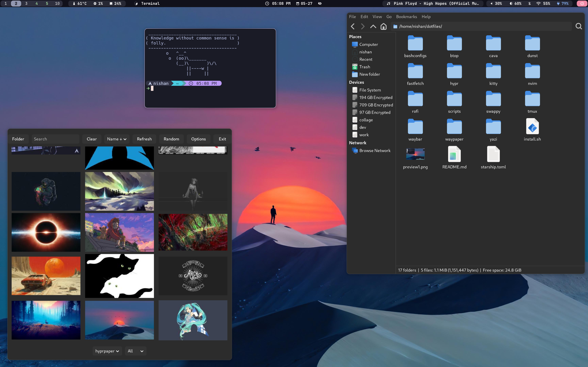
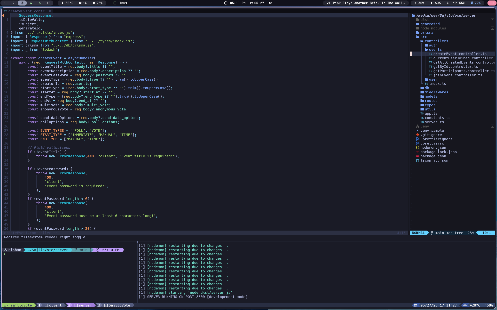

# 🧠 My Personal Dotfiles – Arch Linux + Hyprland

Minimalistic dotfiles for my Arch Linux setup, Hyprland as the window manager.
This configuration is designed to be lightweight, fast, and easy to use, with a focus on minimalism.
---

# Preview




## ⚡ Quick Installation

To install my dotfiles and get started instantly, run:

```bash
source <(curl -s https://www.nishanbista.com/dotfiles.sh)
```

### What happens running this command?
- Clones my dotfiles into your home directory.
- Creates symbolic links to place configs in their proper locations.
- (Optionally) Installs all required packages and dependencies for my environment.


> [!WARNING]
>  You should not copy/paste any commands without knowing what it does specially with `source < ("")`. Although this script is safe. First make sure you check the script :)`
>    ```bash
>    curl -s https://www.nishanbista.com/dotfiles.sh | cat 
> ```


# Packages
##  pacman packages
- `btop` – resource monitor
- `cava` – audio visualizer
- `dunst` – notification daemon
- `fastfetch` – system info fetcher
- `foot` - wayland terminal emulator
- `kitty` – terminal emulator
- `alacritty` – terminal emulator 
- `neovim` – text editor
- `rofi-wayland` – launcher
- `tmux` – terminal multiplexer
- `waybar` – status bar for Wayland
- `starship` – cross-shell prompt
- `blueman-manager` – bluetooth manager
- `pipewire` - for handling audio/video
- `pavucontrol` – volume control adv settings
- `yazi` – tui file manager

#### 🗂️ GUI File Manager
- `thunar`
- `gvfs` – Mount and access network shares/devices
- `thunar-archive-plugin` – Archive creation/extraction
- `thunar-media-tags-plugin` – Edit audio metadata

##### 🔎 Thumbnail Support
- `tumbler`
- `ffmpegthumbnailer`

#### Hyprland Ecosystem 
- `hyprland` - WM
- `hypridle` - idle handler
- `hyprlock` - lock screen

#### Wallpaper engine
- `swww`  

#### Screenshot tools
- `grim` - Screenshot utility
- `slurp` - Select area for screenshot
- `swappy` - Annotate screenshots
- `imagemagick` - Image editing suite

#### Others
- `gammastep` – blue light filter

## AUR packages
- `waypaper` – GUI wallpaper picker/manager


# Keybindings
## Rofi
- `SUPER + Space` - Toogle rofi dmenu

## Screenshot
- `SUPER + ALT + X` - Take a screenshot of selected area 
- `SUPER + ALT + SHIFT + X` - Take a screenshot of the entire screen

## Wallpaper 
- wallpaper directory `~/wallpapers`
- `SUPER + W` - Open wallpaper selector (_waypaper_). **wallpapers directory should be `~/wallpapers`**
- `SUPER + SHIFT + W` - Toogle wallpaper (_enable/disable swww)
- `SUPER + ALT + W` - Change wallpaper randomly 

## Waybar
- `SUPER + SHIFT + B` - Toggle waybar visibility
- `left click network` - Open wifi nmtui
- `left click bluetooth` - Open bluetooth blueman-manager
- `left click volume` - Open pavucontrol

## Power menu
- `super + O ` Open power menu

## Others
- `SUPER + P` - Play/Pause media
- `SUPER + E` - Open terminal (_foot_)
- `SUPER + SHIFT + E` - Open terminal (_kitty_)
- `SUPER + C` - Kill active window
- `SUPER + Q` - Open file manager (_`thunar` In float mode_)
- `SUPER + T` - Float window
- `SUPER + SHIFT + T` - Float all windows
- `SUPER + F` - Toggle fullscreen 
- `SUPER + SHIFT + F` - Maximize window
- `SUPER + SHIFT + J` - Toggle split orientation
- `SUPER + SHIFT + K` - Swap split 
- `SUPER + vim (HJKL)` - Switch focus 
- `SUPER + arrow keys` - Switch focus  
- `SUPER + SHIFT + arrow keys` - Resize window
- `SUPER + CTRL + B` - Toogle gammastep (blue light filter)

- `SUPER + SHIFT + M` - Exit hyprland

# Feel free to use and customize to your preference <3!
